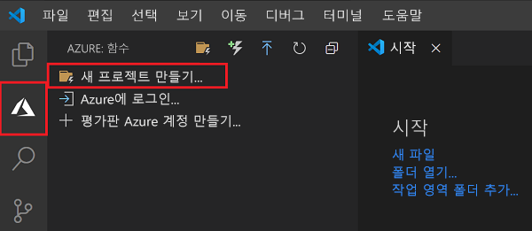
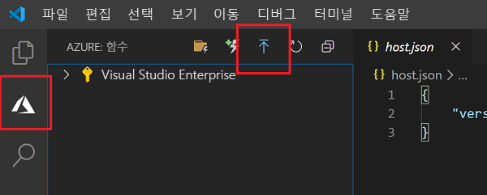

# <a name="develop-and-publish-net-5-functions-using-azure-functions"></a>Azure Functions를 사용하여 .NET 5 함수 개발 및 게시 

이 문서에서는 Azure Functions 런타임에서 Out of Process로 실행되는 .NET 5.0을 사용하여 C# 함수로 작업하는 방법을 보여 줍니다. Azure에 이러한 .NET 격리 프로세스 함수를 만들고, 로컬로 디버그하고, 게시하는 방법을 알아봅니다. Azure에서 이러한 함수는 .NET 5.0을 지원하는 격리 프로세스에서 실행됩니다. 자세한 내용은 [Azure의 .NET 5.0에서 함수를 실행하는 방법에 대한 가이드](dotnet-isolated-process-guide.md)를 참조하세요.

.NET 5.0을 지원하거나 Out of Process 함수를 실행하지 않아도 되는 경우 대신 [C# 클래스 라이브러리 함수를 만들](functions-create-your-first-function-visual-studio.md) 수 있습니다.

>[!NOTE]
>현재 Azure Portal에서 .NET 격리 프로세스 함수를 개발하는 것은 지원되지 않습니다. Azure CLI 또는 Visual Studio Code 게시를 사용하여 Azure에서 Out of Process .NET 5.0 앱의 실행을 지원하는 함수 앱을 만들어야 합니다.   

## <a name="prerequisites"></a>필수 구성 요소

+ 활성 구독이 있는 Azure 계정. [체험 계정을 만듭니다](https://azure.microsoft.com/free/?ref=microsoft.com&utm_source=microsoft.com&utm_medium=docs&utm_campaign=visualstudio).

+ [.NET SDK 5.0](https://www.microsoft.com/net/download)

+ [Azure Functions Core Tools](functions-run-local.md#v2) 버전 3.0.3381 이상.

+ [Azure CLI](/cli/azure/install-azure-cli) 버전 2.20 이상.  
::: zone pivot="development-environment-vscode"
+ [지원되는 플랫폼](https://code.visualstudio.com/docs/supporting/requirements#_platforms) 중 하나인 [Visual Studio Code](https://code.visualstudio.com/).  

+ Visual Studio Code용 [C# 확장](https://marketplace.visualstudio.com/items?itemName=ms-dotnettools.csharp).  

+ Visual Studio Code 버전 1.3.0 이상용 [Azure Functions 확장](https://marketplace.visualstudio.com/items?itemName=ms-azuretools.vscode-azurefunctions).
::: zone-end
::: zone pivot="development-environment-vs"
+ [Visual Studio 2019](https://azure.microsoft.com/downloads/)(**Azure 개발** 워크로드 포함).  
.NET 격리 함수 프로젝트 템플릿 및 게시는 현재 Visual Studio에서 사용할 수 없습니다.
::: zone-end

## <a name="create-a-local-function-project"></a>로컬 함수 프로젝트 만들기

Azure Functions에서 함수 프로젝트는 각각 특정 트리거에 응답하는 하나 이상의 개별 함수에 대한 컨테이너입니다. 프로젝트의 모든 함수는 동일한 로컬 및 호스팅 구성을 공유합니다. 이 섹션에서는 단일 함수가 포함된 함수 프로젝트를 만듭니다.

::: zone pivot="development-environment-vs"

>[!NOTE]  
> 현재는 .NET 격리 함수 프로젝트 생성을 지원하는 Visual Studio 프로젝트 템플릿이 없습니다. 이 문서에서는 Core Tools를 사용하여 C# 프로젝트를 생성하는 방법을 보여 줍니다. 그러면 Visual Studio에서 로컬로 실행하고 디버그할 수 있습니다.  

::: zone-end

::: zone pivot="development-environment-vscode"  
1. 작업 막대에서 Azure 아이콘을 선택한 다음, **Azure: Functions** 영역에서 **새 프로젝트 만들기...** 아이콘을 선택합니다.

    

1. 프로젝트 작업 영역에 대한 디렉터리 위치를 선택하고 **선택** 을 선택합니다.

    > [!NOTE]
    > 다음 단계는 작업 영역 외부에서 완료하도록 설계되었습니다. 이 경우 작업 영역에 포함된 프로젝트 폴더를 선택하지 마십시오.

1. 프롬프트에서 다음 정보를 제공합니다.

    + **함수 프로젝트에 대한 언어 선택**: `C#`을 선택합니다.

    + **.NET 런타임 선택**: `.NET 5 isolated`를 선택합니다.

    + **프로젝트의 첫 번째 함수에 대한 템플릿 선택**: `HTTP trigger`을 선택합니다.

    + **함수 이름 입력**: `HttpExample`.

    + **네임스페이스 입력**: `My.Functions`.

    + **권한 부여 수준**: 누구나 함수 엔드포인트를 호출할 수 있도록 하는 `Anonymous`를 선택합니다. 권한 부여 수준에 대해 알아보려면 [권한 부여 키](functions-bindings-http-webhook-trigger.md#authorization-keys)를 참조하세요.

    + **프로젝트를 여는 방법 선택**: `Add to workspace`을 선택합니다.

1. Visual Studio Code는 이 정보를 사용하여 HTTP 트리거를 통해 Azure Functions 프로젝트를 생성합니다. 탐색기에서 로컬 프로젝트 파일을 볼 수 있습니다. 생성된 파일에 대한 자세한 내용은 [생성된 프로젝트 파일](functions-develop-vs-code.md#generated-project-files)을 참조하세요.
::: zone-end  
::: zone pivot="development-environment-cli,development-environment-vs"  

1. 다음과 같이 `func init` 명령을 실행하여 *LocalFunctionProj* 폴더에 함수 프로젝트를 만듭니다.  

    ```console
    func init LocalFunctionProj --worker-runtime dotnetisolated
    ```
    
    `dotnetisolated`를 지정하면 .NET 5.0에서 실행하는 프로젝트가 생성됩니다.


1. 프로젝트 폴더로 이동합니다.

    ```console
    cd LocalFunctionProj
    ```

    이 폴더에는 [ocal.settings.json](functions-run-local.md#local-settings-file) 및 [host.json](functions-host-json.md) 구성 파일을 비롯하여 프로젝트의 다양한 파일이 있습니다. *local.settings.json* 은 Azure에서 다운로드한 비밀을 포함할 수 있으므로 이 파일은 기본적으로 *.gitignore* 파일의 원본 제어에서 제외됩니다.

1. 다음 명령을 사용하여 함수를 프로젝트에 추가합니다. 여기서 `--name` 인수는 함수(HttpExample)의 고유 이름이고, `--template` 인수는 함수의 트리거(HTTP)를 지정합니다.

    ```console
    func new --name HttpExample --template "HTTP trigger" --authlevel "anonymous"
    ``` 

    `func new`는 HttpExample.cs 코드 파일을 만듭니다.
::: zone-end  

::: zone pivot="development-environment-vscode"  

[!INCLUDE [functions-run-function-test-local-vs-code](../../includes/functions-run-function-test-local-vs-code.md)]

::: zone-end  
::: zone pivot="development-environment-cli" 

[!INCLUDE [functions-run-function-test-local-cli](../../includes/functions-run-function-test-local-cli.md)]

::: zone-end

::: zone pivot="development-environment-vs"

## <a name="run-the-function-locally"></a>로컬에서 함수 실행

이 시점에서 프로젝트 폴더의 루트에 있는 `func start` 명령을 실행하여 C# 격리 함수 프로젝트를 컴파일하고 실행할 수 있습니다. 현재 Visual Studio에서 Out of Process 함수 코드를 디버그하려면 다음 단계를 수행하여 실행 중인 Functions 런타임 프로세스에 디버거를 수동으로 연결해야 합니다.  

1. Visual Studio에서 프로젝트 파일(.csproj)을 엽니다. 프로젝트 코드를 검토 및 수정하고 코드에서 원하는 중단점을 설정할 수 있습니다. 

1. 루트 프로젝트 폴더에서 터미널 또는 명령 프롬프트의 다음 명령을 사용하여 런타임 호스트를 시작합니다.

    ```console
    func start --dotnet-isolated-debug
    ```

    `--dotnet-isolated-debug` 옵션은 프로세스를 계속하기 전에 디버거가 연결될 때까지 기다리도록 지시합니다. 출력 끝부분에 다음과 같은 내용이 표시되어야 합니다. 
    
    <pre>
    ...
    
    Functions:

        HttpExample: [GET,POST] http://localhost:7071/api/HttpExample

    For detailed output, run func with --verbose flag.
    [2021-03-09T08:41:41.904Z] Azure Functions .NET Worker (PID: 81720) initialized in debug mode. Waiting for debugger to attach...
    ...
    
    </pre> 

    `PID: XXXXXX`는 실행 중인 Functions 호스트인 dotnet.exe 프로세스의 PID(프로세스 ID)를 나타냅니다.
 
1. Azure Functions 런타임 출력에서 디버거를 연결할 호스트 프로세스의 프로세스 ID를 기록해 둡니다. 또한 로컬 함수의 URL을 기록해 둡니다.

1. Visual Studio의 **디버그** 메뉴에서 **프로세스에 연결...** 을 선택하고 프로세스 ID와 일치하는 프로세스를 찾은 다음 **연결** 을 선택합니다. 
    
    :::image type="content" source="media/dotnet-isolated-process-developer-howtos/attach-to-process.png" alt-text="Functions 호스트 프로세스에 디버거 연결":::    

    디버거가 연결된 상태에서 함수 코드를 정상적으로 디버그할 수 있습니다.

1. 브라우저의 주소 표시줄에 다음과 같은 형식의 로컬 함수 URL을 입력하고 요청을 실행합니다. 

    `http://localhost:7071/api/HttpExample`

    실행 중인 터미널에 기록된 요청의 추적 출력을 확인해야 합니다. 함수 코드에 설정한 모든 중단점에서 코드 실행이 중지됩니다.

1. 완료 후 터미널로 이동하고 Ctrl + C를 눌러 호스트 프로세스를 중지합니다.
 
함수가 로컬 컴퓨터에서 제대로 실행되는지 확인한 후에 해당 프로젝트를 Azure에 게시해야 합니다.

> [!NOTE]  
> 현재 Visual Studio 게시는 .NET 격리 프로세스 앱에 사용할 수 없습니다. Visual Studio에서 프로젝트 개발을 마친 후에는 Azure CLI를 사용하여 원격 Azure 리소스를 만들어야 합니다. 그런 다음 명령줄에서 Azure Functions Core Tools를 다시 사용하여 Azure에 프로젝트를 게시할 수 있습니다.
::: zone-end

::: zone pivot="development-environment-cli,development-environment-vs" 
## <a name="create-supporting-azure-resources-for-your-function"></a>함수를 지원하는 Azure 리소스 만들기

함수 코드를 Azure에 배포하기 전에 다음 세 가지 리소스를 만들어야 합니다.

- [리소스 그룹](../azure-resource-manager/management/overview.md) - 관련 리소스에 대한 논리 컨테이너입니다.
- [스토리지 계정](../storage/common/storage-account-create.md) - 함수에 대한 상태 및 기타 정보를 유지 관리합니다.
- 함수 앱 - 함수 코드를 실행할 수 있는 환경을 제공합니다. 함수 앱은 로컬 함수 프로젝트에 매핑되며, 함수를 논리적 단위로 그룹화하여 리소스를 더 쉽게 관리, 배포 및 공유할 수 있습니다.

다음 명령을 사용하여 이러한 항목을 만듭니다.

1. 아직 로그인하지 않은 경우 Azure에 로그인합니다.

    ```azurecli
    az login
    ```

    [az login](/cli/azure/reference-index#az_login) 명령은 Azure 계정에 로그인합니다.

1. `westeurope` 지역에 `AzureFunctionsQuickstart-rg`라는 리소스 그룹을 만듭니다.

    ```azurecli
    az group create --name AzureFunctionsQuickstart-rg --location westeurope
    ```
 
    [az group create](/cli/azure/group#az_group_create) 명령은 리소스 그룹을 만듭니다. 일반적으로 `az account list-locations` 명령에서 반환된 사용 가능한 지역을 사용하여 가까운 지역에 리소스 그룹과 리소스를 만듭니다.

1. 범용 스토리지 계정을 리소스 그룹 및 지역에 만듭니다.

    ```azurecli
    az storage account create --name <STORAGE_NAME> --location westeurope --resource-group AzureFunctionsQuickstart-rg --sku Standard_LRS
    ```

    [az storage account create](/cli/azure/storage/account#az_storage_account_create) 명령은 스토리지 계정을 만듭니다. 

    이전 예제에서 `<STORAGE_NAME>`을 사용자에게 적절하고 Azure Storage에서 고유한 이름으로 바꿉니다. 이름은 3~24자의 숫자와 소문자만 포함해야 합니다. `Standard_LRS`는 범용 계정을 지정하며, [Functions로 지원](storage-considerations.md#storage-account-requirements)됩니다.

1. Azure에서 함수 앱을 만듭니다.
   
    ```azurecli
    az functionapp create --resource-group AzureFunctionsQuickstart-rg --consumption-plan-location westeurope --runtime dotnet-isolated --runtime-version 5.0 --functions-version 3 --name <APP_NAME> --storage-account <STORAGE_NAME>
    ```

    [az functionapp create](/cli/azure/functionapp#az_functionapp_create) 명령은 Azure에서 함수 앱을 만듭니다. 
    
    이전 예제에서는 `<STORAGE_NAME>`을 이전 단계에서 사용한 계정의 이름으로 바꾸고, `<APP_NAME>`을 적절하고 전역적으로 고유한 이름으로 바꿉니다. `<APP_NAME>`은 함수 앱의 기본 DNS 도메인이기도 합니다. 
    
    이 명령은 [Azure Functions 소비 계획](consumption-plan.md)에 따라 .NET 5.0을 실행하는 함수 앱을 만듭니다. 이 계획은 이 문서에서 발생하는 사용량의 양에 대해 무료로 제공됩니다. 또한 이 명령은 동일한 리소스 그룹에서 연결된 Azure Application Insights 인스턴스를 프로비전합니다. 이 인스턴스를 사용하여 함수 앱을 모니터링하고 로그를 봅니다. 자세한 내용은 [Azure Functions 모니터링](functions-monitoring.md)을 참조하세요. 인스턴스를 활성화할 때까지 비용이 발생하지 않습니다.

[!INCLUDE [functions-publish-project-cli](../../includes/functions-publish-project-cli.md)]

::: zone-end

::: zone pivot="development-environment-vscode"

[!INCLUDE [functions-sign-in-vs-code](../../includes/functions-sign-in-vs-code.md)]

## <a name="publish-the-project-to-azure"></a>Azure에 프로젝트 게시

이 섹션에서는 Azure 구독에서 함수 앱 및 관련 리소스를 만든 다음, 코드를 배포합니다.

> [!IMPORTANT]
> 기존 함수 앱에 게시하면 Azure에서 해당 앱의 콘텐츠를 덮어씁니다.


1. 작업 막대에서 Azure 아이콘을 선택한 다음, **Azure: Functions** 영역에서 **함수 앱에 배포...** 단추를 선택합니다.

    

1. 프롬프트에서 다음 정보를 제공합니다.

    - **폴더 선택**: 작업 영역에서 폴더를 선택하거나 함수 앱을 포함하는 폴더를 찾습니다. 유효한 함수 앱이 이미 열려 있는 경우에는 이 메시지가 표시되지 않습니다.

    - **구독 선택**: 사용할 구독을 선택합니다. 구독이 한 개만 있으면 이 메시지가 표시되지 않습니다.

    - **Azure에서 함수 앱 선택**: `- Create new Function App`을 선택합니다. (이 문서에서 다루지 않는 `Advanced` 옵션은 선택하지 마세요.)
      
    - **함수 앱에 대해 전역적으로 고유 이름을 입력합니다**. URL 경로에 유효한 이름을 입력합니다. 입력한 이름이 Azure Functions에서 고유한지 확인하기 위해 유효성을 검사합니다.
    
    - **런타임 스택 선택**: `.NET 5 (non-LTS)`을 선택합니다. 
    
    - **새 리소스의 위치 선택**:  성능을 향상시키려면 근처에 있는 [지역](https://azure.microsoft.com/regions/)을 선택합니다. 
    
    알림 영역에서 Azure에 생성된 개별 리소스의 상태를 확인할 수 있습니다.

    :::image type="content" source="../../includes/media/functions-publish-project-vscode/resource-notification.png" alt-text="Azure 리소스 생성 알림":::
    
1.  완료되면 함수 앱 이름을 기반으로 하는 이름을 사용하여 구독에 다음 Azure 리소스가 생성됩니다.
    
    [!INCLUDE [functions-vs-code-created-resources](../../includes/functions-vs-code-created-resources.md)]

    함수 앱을 만들고 배포 패키지가 적용되면 알림이 표시됩니다. 

    [!INCLUDE [functions-vs-code-create-tip](../../includes/functions-vs-code-create-tip.md)]

4. 이 알림에서 **출력 보기** 를 선택하여 사용자가 만든 Azure 리소스를 포함한 만들기 및 배포 결과를 표시합니다. 알림이 누락된 경우 오른쪽 아래 모서리에 있는 종 모양 아이콘을 선택하여 다시 확인합니다.

    

::: zone-end

::: zone pivot="development-environment-cli"  
[!INCLUDE [functions-run-remote-azure-cli](../../includes/functions-run-remote-azure-cli.md)]  
::: zone-end  

::: zone pivot="development-environment-vscode"  
[!INCLUDE [functions-vs-code-run-remote](../../includes/functions-vs-code-run-remote.md)]  
::: zone-end  

## <a name="clean-up-resources"></a>리소스 정리

이 문서를 완료하는 리소스를 만들었습니다. [계정 상태](https://azure.microsoft.com/account/) 및 [서비스 가격 책정](https://azure.microsoft.com/pricing/)에 따라 리소스에 대해 요금이 청구될 수 있습니다. 

::: zone pivot="development-environment-cli"  
추가 비용이 발생하지 않도록 다음 명령을 사용하여 리소스 그룹과 그룹에 포함된 모든 리소스를 삭제합니다.

```azurecli
az group delete --name AzureFunctionsQuickstart-rg
```
::: zone-end  

::: zone pivot="development-environment-vscode"  
추가 비용이 발생하지 않도록 다음 단계를 수행하여 함수 앱 및 관련 리소스를 삭제합니다.

[!INCLUDE [functions-cleanup-resources-vs-code-inner.md](../../includes/functions-cleanup-resources-vs-code-inner.md)]  
::: zone-end  
::: zone pivot="development-environment-vs"   
어떠한 추가 비용도 발생하지 않도록 다음 단계를 수행하여 함수 앱 및 관련 리소스를 삭제합니다.

1. 클라우드 탐색기에서 구독 > **App Services** 를 확장하고 함수 앱을 마우스 오른쪽 단추로 클릭한 다음, **포털에서 열기** 를 선택합니다. 

1. 함수 앱 페이지에서 **개요** 탭을 선택한 다음, **리소스 그룹** 아래의 링크를 선택합니다.

   :::image type="content" source="media/functions-create-your-first-function-visual-studio/functions-app-delete-resource-group.png" alt-text="함수 앱 페이지에서 삭제할 리소스 그룹 선택":::

2. **리소스 그룹** 페이지에서 포함된 리소스 목록을 검토하고 삭제하려는 항목인지 확인합니다.
 
3. **리소스 그룹 삭제** 를 선택하고 지시를 따릅니다.

   삭제는 몇 분 정도 소요됩니다. 완료되면 알림이 잠시 표시됩니다. 페이지 위쪽의 종 모양 아이콘을 선택해도 알림을 확인할 수 있습니다.
::: zone-end

## <a name="next-steps"></a>다음 단계

> [!div class="nextstepaction"]
> [.NET 격리 함수에 대해 자세히 알아보기](dotnet-isolated-process-guide.md)

