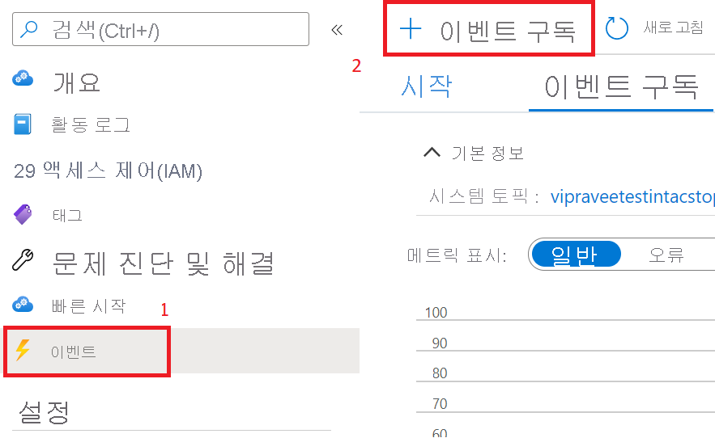
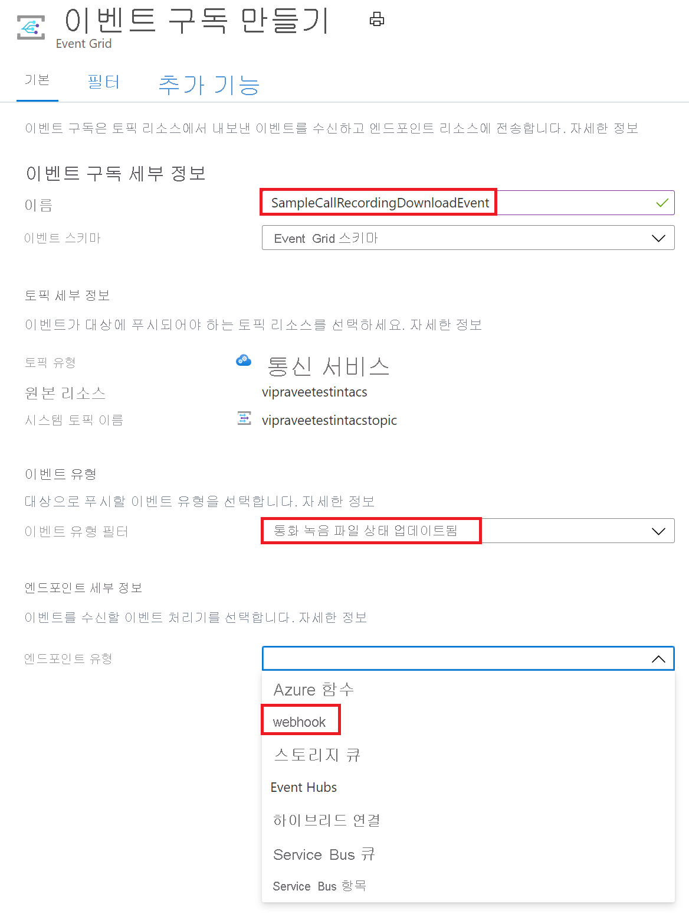
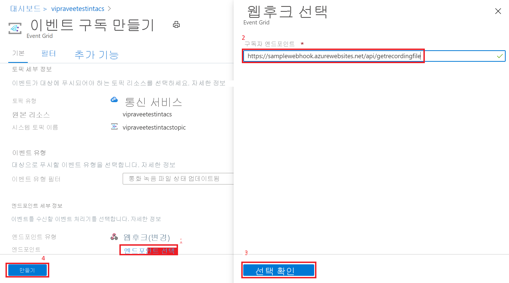

# <a name="record-and-download-calls-with-event-grid"></a>Event Grid를 사용하여 통화 녹화 및 다운로드

[!INCLUDE [Private Preview Notice](../../includes/private-preview-include.md)]

Azure Event Grid를 사용해서 Azure Communication Services 통화를 녹화하여 Azure Communication Services를 시작합니다.

## <a name="prerequisites"></a>사전 요구 사항
- 활성 구독이 있는 Azure 계정. [체험 계정을 만듭니다](https://azure.microsoft.com/free/?WT.mc_id=A261C142F).
- 활성 Communication Services 리소스 [Communication Services 리소스를 만듭니다](../create-communication-resource.md?pivots=platform-azp&tabs=windows).
- [`Microsoft.Azure.EventGrid`](https://www.nuget.org/packages/Microsoft.Azure.EventGrid/) NuGet 패키지

## <a name="create-a-webhook-and-subscribe-to-the-recording-events"></a>웹후크를 만들고 녹화 이벤트를 구독합니다.
*웹후크* 및 *이벤트* 를 사용하면 통화 녹화와 미디어 파일 다운로드를 쉽게 진행할 수 있습니다. 

먼저 웹후크를 만듭니다. Communication Services 리소스는 `recording` 이벤트를 트리거할 때 Event Grid를 사용하여 이 웹후크에 알린 다음, 녹화된 미디어를 다운로드할 준비가 되면 다시 알립니다.

사용자 고유의 사용자 지정 웹후크를 작성하여 이러한 이벤트 알림을 받을 수 있습니다. 이 웹후크는 이벤트 서비스에 대한 웹후크를 성공적으로 구독하기 위해 유효성 검사 코드를 사용하여 인바운드 메시지에 응답하는 것이 중요합니다.

```csharp
[HttpPost]
public async Task<ActionResult> PostAsync([FromBody] object request)
  {
   //Deserializing the request 
    var eventGridEvent = JsonConvert.DeserializeObject<EventGridEvent[]>(request.ToString())
        .FirstOrDefault();
    var data = eventGridEvent.Data as JObject;

    // Validate whether EventType is of "Microsoft.EventGrid.SubscriptionValidationEvent"
    if (string.Equals(eventGridEvent.EventType, EventTypes.EventGridSubscriptionValidationEvent, StringComparison.OrdinalIgnoreCase))
   {
        var eventData = data.ToObject<SubscriptionValidationEventData>();
        var responseData = new SubscriptionValidationResponseData
        {
            ValidationResponse = eventData.ValidationCode
        };
        if (responseData.ValidationResponse != null)
        {
            return Ok(responseData);
        }
    }

    // Implement your logic here.
    ...
    ...
  }
```

위의 코드는 `Microsoft.Azure.EventGrid` NuGet 패키지에 따라 달라집니다. Event Grid 엔드포인트 유효성 검사에 대해 자세히 알아보려면 [엔드포인트 유효성 검사 문서](../../../event-grid/receive-events.md#endpoint-validation)를 참조하세요.

그런 다음, 이 웹후크로 `recording` 이벤트를 구독합니다.

1. Azure Communication Services 리소스의 `Events`를 선택합니다.
2. 아래와 같이 `Event Subscription`을 선택합니다.

3. 이벤트 구독을 구성하고 `Call Recording File Status Update`를 `Event Type`으로 선택합니다. `Webhook`를 `Endpoint type`으로 선택합니다.

4. 웹후크의 URL을 `Subscriber Endpoint`에 입력합니다.


이제 Communication Services 리소스를 사용하여 통화를 녹화할 때마다 웹후크에 알림이 제공됩니다.

## <a name="notification-schema"></a>알림 스키마
녹화를 다운로드할 수 있는 경우 Communication Services 리소스는 다음과 같은 이벤트 스키마를 사용하여 알림을 내보냅니다. 녹화의 문서 ID는 각 `documentId` `recordingChunk` 필드에 대해 가져올 수 있습니다.

```json
{
    "id": string, // Unique guid for event
    "topic": string, // Azure Communication Services resource id
    "subject": string, // /recording/call/{call-id}
    "data": {
        "recordingStorageInfo": {
            "recordingChunks": [
                {
                    "documentId": string, // Document id for retrieving from AMS storage
                    "index": int, // Index providing ordering for this chunk in the entire recording
                    "endReason": string, // Reason for chunk ending: "SessionEnded", "ChunkMaximumSizeExceeded”, etc.
                }
            ]
        },
        "recordingStartTime": string, // ISO 8601 date time for the start of the recording
        "recordingDurationMs": int, // Duration of recording in milliseconds
        "sessionEndReason": string // Reason for call ending: "CallEnded", "InitiatorLeft”, etc.
    },
    "eventType": string, // "Microsoft.Communication.RecordingFileStatusUpdated"
    "dataVersion": string, // "1.0"
    "metadataVersion": string, // "1"
    "eventTime": string // ISO 8601 date time for when the event was created
}

```

## <a name="download-the-recorded-media-files"></a>녹화된 미디어 파일 다운로드

다운로드하려는 파일의 문서 ID를 받으면 아래 Azure Communication Services API를 호출하여 HMAC 인증을 사용해서 녹화된 미디어와 메타데이터를 다운로드합니다.

최대 녹화 파일의 크기는 1.5GB입니다. 이 파일 크기를 초과하면 레코더에서 녹화된 미디어를 자동으로 여러 파일로 분할합니다.

클라이언트는 단일 요청으로 모든 미디어 파일을 다운로드할 수 있어야 합니다. 문제가 발생하는 경우 클라이언트는 범위 헤더로 다시 시도하여 이미 다운로드한 세그먼트를 다시 다운로드하지 않도록 할 수 있습니다.

녹화된 미디어를 다운로드하려면 다음을 사용하세요. 
- 메서드: `GET` 
- URL: https://contoso.communication.azure.com/recording/download/{documentId}?api-version=2021-04-15-preview1

녹화된 미디어 메타데이터를 다운로드하려면 다음을 사용하세요. 
- 메서드: `GET` 
- URL: https://contoso.communication.azure.com/recording/download/{documentId}/metadata?api-version=2021-04-15-preview1


### <a name="authentication"></a>인증
녹화된 미디어 및 메타데이터를 다운로드하려면 HMAC 인증을 사용하여 Azure Communication Services API에 대한 요청을 인증합니다.

`HttpClient`를 만들고 아래 제공된 `HmacAuthenticationUtils`를 사용하여 필요한 헤더를 추가합니다.

```csharp
  var client = new HttpClient();

  // Set Http Method
  var method = HttpMethod.Get;
  StringContent content = null;

  // Build request
  var request = new HttpRequestMessage
  {
      Method = method, // Http GET method
      RequestUri = new Uri(<Download_Recording_Url>), // Download recording Url
      Content = content // content if required for POST methods
  };

  // Question: Why do we need to pass String.Empty to CreateContentHash() method?
  // Answer: In HMAC authentication, the hash of the content is one of the parameters used to generate the HMAC token.
  // In our case our recording download APIs are GET methods and do not have any content/body to be passed in the request. 
  // However in this case we still need the SHA256 hash for the empty content and hence we pass an empty string. 


  string serializedPayload = string.Empty;

  // Hash the content of the request.
  var contentHashed = HmacAuthenticationUtils.CreateContentHash(serializedPayload);

  // Add HMAC headers.
  HmacAuthenticationUtils.AddHmacHeaders(request, contentHashed, accessKey, method);

  // Make a request to the Azure Communication Services APIs mentioned above
  var response = await client.SendAsync(request).ConfigureAwait(false);
```

#### <a name="hmacauthenticationutils"></a>HmacAuthenticationUtils 
아래 유틸리티를 사용하여 HMAC 워크플로를 관리할 수 있습니다.

**콘텐츠 해시 만들기**

```csharp
public static string CreateContentHash(string content)
{
    var alg = SHA256.Create();

    using (var memoryStream = new MemoryStream())
    using (var contentHashStream = new CryptoStream(memoryStream, alg, CryptoStreamMode.Write))
    {
        using (var swEncrypt = new StreamWriter(contentHashStream))
        {
            if (content != null)
            {
                swEncrypt.Write(content);
            }
        }
    }

    return Convert.ToBase64String(alg.Hash);
}
```

**HMAC 헤더 추가**

```csharp
public static void AddHmacHeaders(HttpRequestMessage requestMessage, string contentHash, string accessKey)
{
    var utcNowString = DateTimeOffset.UtcNow.ToString("r", CultureInfo.InvariantCulture);
    var uri = requestMessage.RequestUri;
    var host = uri.Authority;
    var pathAndQuery = uri.PathAndQuery;

    var stringToSign = $"{requestMessage.Method}\n{pathAndQuery}\n{utcNowString};{host};{contentHash}";
    var hmac = new HMACSHA256(Convert.FromBase64String(accessKey));
    var hash = hmac.ComputeHash(Encoding.ASCII.GetBytes(stringToSign));
    var signature = Convert.ToBase64String(hash);
    var authorization = $"HMAC-SHA256 SignedHeaders=date;host;x-ms-content-sha256&Signature={signature}";

    requestMessage.Headers.Add("x-ms-content-sha256", contentHash);
    requestMessage.Headers.Add("Date", utcNowString);
    requestMessage.Headers.Add("Authorization", authorization);
}
```

## <a name="clean-up-resources"></a>리소스 정리
Communication Services 구독을 정리하고 제거하려면 리소스 또는 리소스 그룹을 삭제하면 됩니다. 리소스 그룹을 삭제하면 해당 리소스 그룹에 연결된 다른 모든 리소스가 함께 삭제됩니다. [리소스 정리](../create-communication-resource.md?pivots=platform-azp&tabs=windows#clean-up-resources)에 대해 자세히 알아보세요.


## <a name="next-steps"></a>다음 단계
자세한 내용은 다음 문서를 참조하세요.

- [웹 통화 샘플](../../samples/web-calling-sample.md) 확인
- [통화 SDK 기능](./calling-client-samples.md?pivots=platform-web)에 대해 알아보기
- [호출 작동 방식](../../concepts/voice-video-calling/about-call-types.md)에 대해 자세히 알아보기
