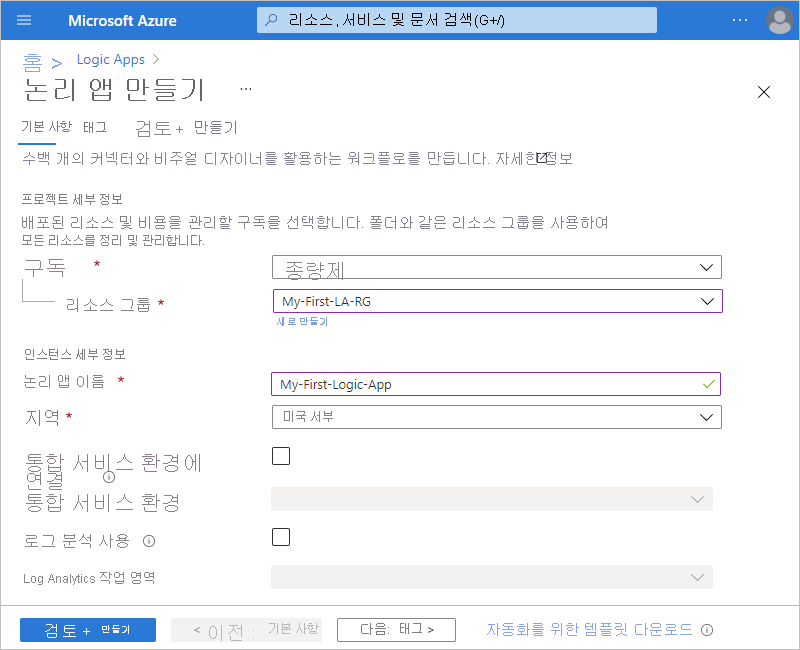
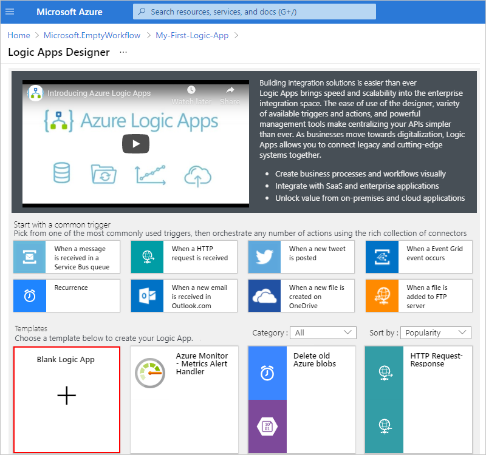
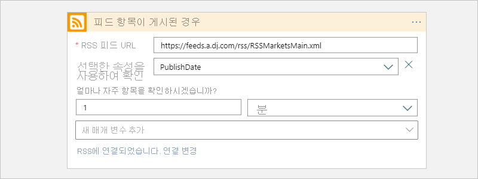
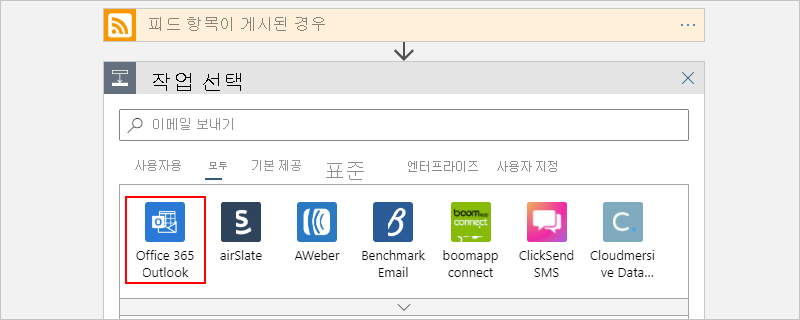
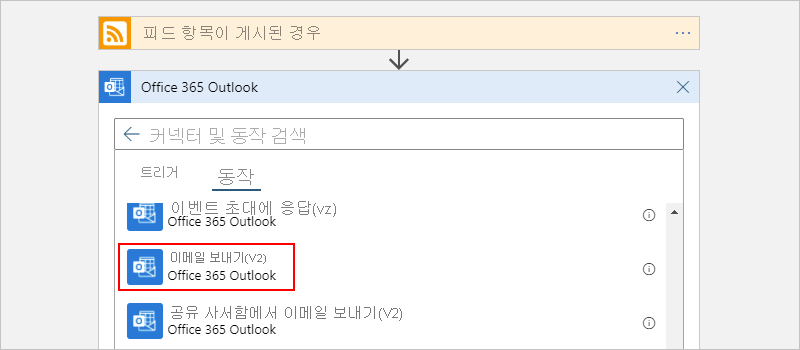
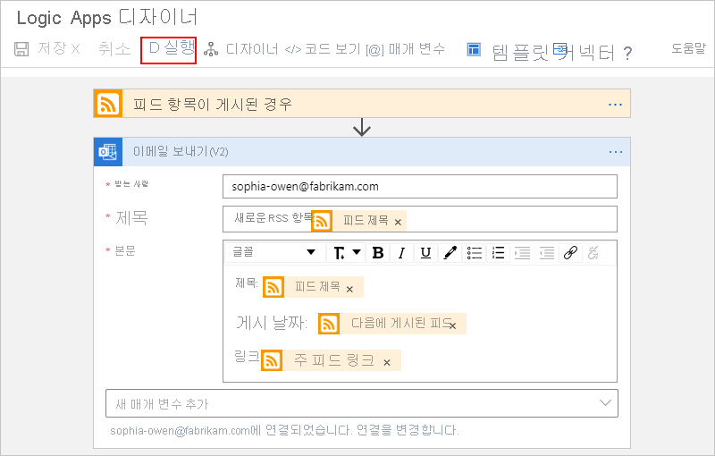
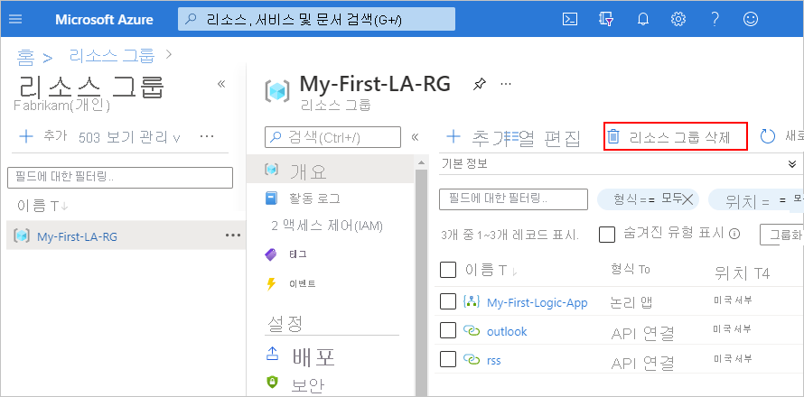

# 빠른 시작: Azure Portal에서 Azure Logic Apps를 사용하여 통합 워크플로 만들기

이 빠른 시작에서는 [Azure Logic Apps](logic-apps-overview.md)를 사용할 때 웹 사이트의 RSS 피드와 이메일 계정에 대한 두 서비스를 통합하는 자동화된 워크플로 예제를 만드는 방법을 보여 줍니다. 이 예제는 클라우드 기반이지만, Logic Apps는 클라우드, 온-프레미스 및 하이브리드 환경의 앱, 데이터, 서비스 및 시스템을 연결하는 워크플로를 지원합니다.

이 예제에서는 RSS 커넥터와 Office 365 Outlook 커넥터를 사용하는 워크플로를 만듭니다. RSS 커넥터에는 일정에 따라 RSS 피드를 확인하는 트리거가 있습니다. Office 365 Outlook 커넥터에는 각 새 항목에 대한 이메일을 보내는 작업이 있습니다. 이 예제의 커넥터는 워크플로에서 사용할 수 있는 [수백 개의 커넥터](/connectors/connector-reference/connector-reference-logicapps-connectors) 중 두 개일 뿐입니다.

다음 스크린샷에서는 개략적인 예제 워크플로를 보여 줍니다.

이 빠른 시작을 진행하면서 다음과 같은 기본 단계를 배우게 됩니다.

* 다중 테넌트 Logic Apps 서비스 환경에서 실행되는 논리 앱 리소스를 만듭니다.
* 빈 논리 앱 템플릿을 선택합니다.
* 워크플로를 실행할 시기를 지정하는 트리거를 추가합니다.
* 트리거 작동 후 태스크를 수행하는 작업을 추가합니다.
* 워크플로를 실행합니다.

다른 도구를 사용하여 논리 앱을 만들고 관리하려면 다음과 같은 다른 Logic Apps 빠른 시작을 검토하세요.

* [Visual Studio Code에서 논리 앱 만들기 및 관리](quickstart-create-logic-apps-visual-studio-code.md)
* [Visual Studio에서 논리 앱 만들기 및 관리](quickstart-create-logic-apps-with-visual-studio.md)
* [Azure CLI(Azure 명령줄 인터페이스)를 사용하여 논리 앱 만들기 및 관리](quickstart-logic-apps-azure-cli.md)

## 필수 구성 요소

* Azure 구독이 아직 없는 경우 시작하기 전에 [Azure 체험 계정에 등록합니다](https://azure.microsoft.com/free/?WT.mc_id=A261C142F).

* Azure Logic Apps와 함께 작동하는 서비스의 이메일 계정(예: Office 365 Outlook 또는 Outlook.com). 지원되는 다른 이메일 공급자는 [Logic Apps용 커넥터](/connectors/connector-reference/connector-reference-logicapps-connectors)를 참조하세요.

  > [!NOTE]
  > [Gmail 커넥터](/connectors/gmail/)를 사용하려는 경우 G Suite 계정만 Azure Logic Apps 앱에서 제한 없이 이 커넥터를 사용할 수 있습니다. 소비자 Gmail 계정이 있는 경우 [Gmail 커넥터 인증에 사용할 Google 클라이언트 앱을 만들지](/connectors/gmail/#authentication-and-bring-your-own-application) 않는 한 특정 Google 승인 서비스에서만 이 커넥터를 사용할 수 있습니다. 자세한 내용은 [Azure Logic Apps의 Google 커넥터에 대한 데이터 보안 및 개인정보처리방침](../connectors/connectors-google-data-security-privacy-policy.md)을 참조하세요.

* 특정 IP 주소로 트래픽을 제한하는 방화벽이 있을 경우, 논리 앱이 있는 Azure 지역의 Logic Apps 서비스에서 사용하는 [인바운드](logic-apps-limits-and-config.md#inbound) 및 [아웃바운드](logic-apps-limits-and-config.md#outbound) IP 주소 *모두* 에 대한 액세스를 허용하도록 방화벽을 설정합니다.

  또한 이 예에서는 [Microsoft에서 관리](../connectors/managed.md)하는 RSS 및 Office 365 Outlook 커넥터를 사용합니다. 이러한 커넥터를 사용하려면 논리 앱의 Azure 지역에서 *모든* [관리형 커넥터 아웃바운드 IP 주소](logic-apps-limits-and-config.md#outbound)에 대한 액세스를 허용하도록 방화벽을 설정해야 합니다.

## 논리 앱 리소스 만들기

1. Azure 계정을 사용하여 [Azure Portal](https://portal.azure.com) 에 로그인합니다.

1. Azure Portal 검색 상자에 `logic apps`를 입력하고 **Logic Apps** 를 선택합니다.

   

1. **Logic Apps** 페이지에서 **추가** > **소비** 를 선택합니다.

   이 단계에서는 다중 테넌트 Logic Apps 서비스 환경에서 실행되고 [소비 가격 책정 모델](logic-apps-pricing.md)을 사용하는 논리 앱 리소스를 만듭니다.

   

1. **논리 앱** 창에서 논리 앱에 대한 기본 세부 정보와 설정을 제공합니다. 이 예제 논리 앱에 대한 새 [리소스 그룹](../azure-resource-manager/management/overview.md#terminology)을 만듭니다.

   | 속성 | 값 | Description |
   |----------|-------|-------------|
   | **구독** | <*Azure-subscription-name*> | Azure 구독의 이름입니다. |
   | **리소스 그룹** | <*Azure-resource-group-name*> | [Azure 리소스 그룹](../azure-resource-manager/management/overview.md#terminology) 이름으로, 지역에서 고유해야 합니다. 이 예제에서는 “My-First-LA-RG”를 사용합니다. |
   | **논리 앱 이름**. | <*logic-app-name*> | 지역에서 고유해야 하는 논리 앱의 이름입니다. 이 예제에서는 “My-First-Logic-App”을 사용합니다. 

**중요**: 이름에는 문자, 숫자, 하이픈(`-`), 밑줄(`_`), 괄호(`(`, `)`) 및 마침표(`.`)만 포함될 수 있습니다.  |
   | **지역** | <*Azure-region*> | 앱의 정보를 저장할 Azure 데이터 센터 지역입니다. 이 예제에서는 “미국 서부”를 사용합니다. |
   | **통합 서비스 환경에 연결** | 끄기 | 이 논리 앱을 [통합 서비스 환경](connect-virtual-network-vnet-isolated-environment-overview.md)에 배포하려는 경우에만 이 옵션을 선택합니다. 이 예제에서는 이 옵션을 선택하지 않은 상태로 둡니다. |
   | **로그 분석 사용** | 끄기 | 진단 로깅을 사용하도록 설정하려는 경우에만 이 옵션을 선택합니다. 이 예제에서는 이 옵션을 선택하지 않은 상태로 둡니다. |
   ||||

   

1. 준비가 되면 **검토 + 만들기** 를 선택합니다. 유효성 검사 페이지에서 입력한 세부 정보를 확인하고 **만들기** 를 선택합니다.

## 빈 템플릿 선택

1. Azure가 앱을 성공적으로 배포하면 **리소스로 이동** 을 선택합니다. 또는 Azure 검색 상자에 이름을 입력하여 논리 앱을 찾아 선택할 수 있습니다.

   

   Logic Apps 디자이너가 열리고 소개 비디오 및 많이 사용되는 트리거가 포함된 페이지를 보여줍니다.

1. **템플릿** 아래에서 **빈 논리 앱** 을 선택합니다.

   

   템플릿을 선택하면 디자이너에서 이제 빈 워크플로 화면을 표시합니다.

## 트리거 추가

워크플로는 항상 워크플로에서 작업을 실행하기 전에 충족해야 하는 조건을 지정하는 단일 [트리거](../logic-apps/logic-apps-overview.md#how-do-logic-apps-work)로 시작됩니다. 트리거가 작동할 때마다 Logic Apps 서비스는 워크플로 인스턴스를 만들고 실행합니다. 트리거가 작동하지 않으면 인스턴스가 만들어지거나 실행되지 않습니다. 여러 트리거 중에서 선택하여 워크플로를 시작할 수 있습니다.

이 예제에서는 일정에 따라 RSS 피드를 확인하는 RSS 트리거를 사용합니다. 피드에 새 항목이 있으면 트리거가 작동하고 새 워크플로 인스턴스가 실행되기 시작합니다. 확인하는 사이에 새 항목이 여러 개 발견되면 각 항목에 대해 트리거가 작동하며, 각 항목별로 새 워크플로 인스턴스가 실행됩니다.

1. **Logic Apps 디자이너** 의 검색 상자에서 **모두** 를 선택합니다.

1. RSS 커넥터를 찾으려면 검색 상자에 `rss`를 입력합니다. **트리거** 목록에서 **피드 항목이 게시된 경우** RSS 트리거를 선택합니다.

   

1. 트리거 세부 정보에 다음 정보를 입력합니다.

   | 속성 | 필수 | 값 | Description |
   |----------|----------|-------|-------------|
   | **RSS 피드 URL** | 예 | <*RSS-feed-URL*> | 모니터링할 RSS 피드 URL입니다. 

이 예제에서는 `https://feeds.a.dj.com/rss/RSSMarketsMain.xml`에 있는 Wall Street Journal의 RSS 피드를 사용합니다. 그러나 HTTP 권한 부여가 필요하지 않은 RSS 피드를 사용할 수 있습니다. 자주 게시되는 RSS 피드를 선택합니다. 그러면 워크플로를 쉽게 테스트할 수 있습니다. |
   | **선택한 속성을 사용하여 확인** | 예 | PublishDate | 새 항목을 결정하는 속성입니다. |
   | **간격** | 예 | 1 | 피드 확인 간에 대기하는 간격(숫자)입니다. 

이 예제에서는 `1`을 간격으로 사용합니다. |
   | **빈도** | 예 | Minute | 모든 간격에 사용할 빈도 단위입니다. 

이 예제에서는 `Minute`를 빈도로 사용합니다. |
   |||||

   

1. 지금은 제목 표시줄 내부를 클릭하여 트리거의 세부 정보를 접습니다.

   

1. 완료되면 논리 앱을 저장합니다. 이 앱은 Azure Portal에서 즉시 라이브 상태가 됩니다. 디자이너 도구 모음에서 **저장** 을 선택합니다.

   트리거는 RSS 피드를 확인하는 것 외에 다른 작업을 수행하지 않습니다. 따라서 트리거가 작동하면 어떻게 해야 하는지 정의하는 작업을 추가해야 합니다.

## 작업 추가

트리거 후에 실행되는 [작업](../logic-apps/logic-apps-overview.md#logic-app-concepts)은 워크플로에서 일부 작업을 실행하는 후속 단계입니다. 모든 작업은 이전 단계의 출력을 사용할 수 있습니다. 이는 트리거나 다른 작업이 될 수 있습니다. 다양한 작업 중에서 선택하고, [워크플로당 한도](logic-apps-limits-and-config.md#definition-limits) 이내에서 여러 개의 작업을 추가하고, 여러 작업 경로를 만들 수도 있습니다.

이 예제에서는 새 RSS 피드 항목에 대한 트리거가 작동할 때마다 이메일을 보내는 Office 365 Outlook 작업을 사용합니다. 검사 중간에 새 항목이 여러 개 발견되면 여러 통의 이메일이 수신됩니다.

1. **피드 항목이 게시된 경우** 트리거 아래에서 **새 단계** 를 선택합니다.

   

1. **작업 선택** 및 검색 상자 아래에서 **모두** 를 선택합니다.

1. 이 작업을 제공하는 커넥터를 찾을 수 있도록 검색 상자에 `send an email`을 입력합니다. **작업** 목록을 특정 앱 또는 서비스로 필터링하려면 먼저 해당 앱 또는 서비스를 선택합니다.

   예를 들어 Microsoft 회사 또는 학교 계정이 있고 Office 365 Outlook을 사용하려는 경우에는 **Office 365 Outlook** 을 선택합니다. 또는 개인 Microsoft 계정이 있는 경우에는 **Outlook.com** 을 선택합니다. 이 예제에서는 Office 365 Outlook을 사용하여 진행합니다.

   > [!NOTE]
   > 워크플로에서 지원되는 다른 이메일 서비스를 사용하는 경우 사용자 인터페이스가 약간 다르게 보일 수 있습니다. 그러나 다른 이메일 서비스에 연결하기 위한 기본 개념은 동일하게 유지됩니다.

   

   이제 사용하려는 작업(예: **이메일 보내기**)을 보다 쉽게 찾아서 선택할 수 있습니다.

   

1. 선택한 이메일 서비스에서 로그인하고 ID를 인증하라는 메시지가 표시되면 지금 해당 단계를 완료합니다.

   대다수의 커넥터는 먼저 연결을 만들고 ID를 인증해야 계속할 수 있습니다.

   

   > [!NOTE]
   > 이 예제에서는 Office 365 Outlook에 연결하기 위한 수동 인증을 보여 줍니다. 그러나 다른 서비스는 다양한 인증 유형을 지원하거나 사용할 수 있습니다. 상황에 따라 여러 가지 방법으로 연결 인증을 처리할 수 있습니다.
   > 
   > 예를 들어 Azure Resource Manager 템플릿을 배포에 사용하는 경우 연결 세부 정보와 같은 값을 매개 변수화하여 자주 변경되는 입력에 대한 보안을 강화할 수 있습니다. 자세한 내용은 다음 항목을 참조하세요.
   >
   > * [배포용 템플릿 매개 변수](../logic-apps/logic-apps-azure-resource-manager-templates-overview.md#template-parameters)
   > * [OAuth 연결 권한 부여](../logic-apps/logic-apps-deploy-azure-resource-manager-templates.md#authorize-oauth-connections)
   > * [관리 ID를 사용하여 액세스 인증](../logic-apps/create-managed-service-identity.md)
   > * [논리 앱 배포를 위한 연결 인증](../logic-apps/logic-apps-azure-resource-manager-templates-overview.md#authenticate-connections)

1. **이메일 보내기** 작업에서 이메일에 포함할 정보를 지정합니다.

   1. **받는 사람** 상자에 받는 사람의 이메일 주소를 입력합니다. 이 예제에서는 이메일 주소를 사용합니다.

      > [!NOTE]
      > **받는 사람** 상자 및 특정 입력 유형에 대한 다른 상자 안쪽을 클릭하면 **동적 콘텐츠 추가** 목록이 표시됩니다. 이 목록에는 현재 작업에 대한 입력으로 선택할 수 있는 이전 단계의 모든 출력이 표시됩니다. 지금은 이 목록을 무시할 수 있습니다. 다음 단계에서는 동적 콘텐츠 목록을 사용합니다.

   1. **주제** 상자에 전자 메일 제목을 입력합니다. 이 예제에서는 후행 공백이 포함된 `New RSS item: ` 텍스트를 입력합니다.

      

   1. **동적 콘텐츠 추가** 목록의 **피드 항목이 게시된 경우** 아래에서 **피드 제목** 을 선택합니다.

      피드 제목은 RSS 항목의 제목을 참조하는 트리거 출력입니다. 이메일은 이 출력을 사용하여 RSS 항목의 제목을 표시합니다.

      

      > [!TIP]
      > 동적 콘텐츠 목록에서 **피드 항목이 게시된 경우** 트리거의 출력이 표시되지 않으면 작업의 헤더 옆에 있는 **자세히 보기** 를 선택합니다.
      > 
      > 

      작업이 완료되면 전자 메일 제목이 다음 예제와 같이 표시됩니다.

      

      > [!NOTE]
      > 디자이너에 **각각** 루프가 표시되는 경우 **categories-Item** 속성과 같이 배열을 참조하는 출력을 선택했습니다. 이 출력 유형의 경우 디자이너가 출력을 참조하는 작업에 대한 **각각** 루프를 자동으로 추가합니다. 그렇게 하면 워크플로가 각 배열 항목에 대해 동일한 작업을 수행합니다. 
      >
      > 루프를 제거하려면 루프의 제목 표시줄에서 줄임표( **...** ) 단추를 선택한 다음, **삭제** 를 선택합니다.

   1. **본문** 상자에 이메일 본문 콘텐츠를 입력합니다.
   
      이 예제에서는 본문에 다음 속성이 포함되며, 이 다음에 각 속성을 설명하는 텍스트가 포함됩니다. 편집 상자에서 빈 줄을 추가하려면 Shift + Enter 키를 누릅니다.

      | 설명 텍스트 | 속성 | Description |
      |------------------|----------|-------------|
      | `Title:` | **피드 제목** | 항목의 제목 |
      | `Date published:` | **다음에 게시된 피드** | 항목의 게시 날짜 및 시간 |
      | `Link:` | **주 피드 링크** | 항목의 URL |
      ||||

      

1. 논리 앱을 저장합니다. 디자이너 도구 모음에서 **저장** 을 선택합니다.

## 워크플로 실행

워크플로가 제대로 실행되는지 확인하려면 트리거가 설정된 일정에 따라 RSS 피드를 확인할 때까지 기다리면 됩니다. 또는 다음 스크린샷과 같이 Logic Apps 디자이너 도구 모음에서 **실행** 을 선택하여 워크플로를 수동으로 실행할 수 있습니다. 

RSS 피드에 새 항목이 있는 경우 워크플로가 새 항목 각각에 이메일을 보냅니다. 그렇지 않은 경우 워크플로가 RSS 피드를 다시 확인하기 위해 다음 간격까지 기다립니다. 

다음 스크린샷은 예제 워크플로에서 보낸 샘플 이메일을 보여 줍니다. 이 이메일에는 선택한 각 트리거 출력의 세부 정보와 각 항목에 대해 입력한 설명 텍스트가 포함됩니다.

## 문제 해결

워크플로에서 예상한 이메일을 받지 못한 경우:

* 메시지가 잘못 필터링된 경우 이메일 계정의 정크 또는 스팸 폴더를 확인합니다.
* 사용 중인 RSS 피드에서 마지막 예약 또는 수동 확인 이후 항목을 게시했는지 확인합니다.

## 리소스 정리

이 빠른 시작을 완료했으면 이 예제를 위해 만든 리소스 그룹을 삭제하여 샘플 논리 앱 및 관련 리소스를 정리합니다.

1. Azure 검색 상자에 `resource groups`을 입력한 다음, **리소스 그룹** 을 선택합니다.

   

1. 해당하는 논리 앱의 리소스 그룹을 찾아서 선택합니다. **개요** 창에서 **리소스 그룹 삭제** 를 선택합니다.

   

1. 확인 창이 표시되면 리소스 그룹 이름을 입력하고 **삭제** 를 선택합니다.

   

## 다음 단계

이 빠른 시작에서는 Azure Portal에서 RSS 피드를 확인하고 각 새 항목에 대한 이메일을 보내기 위해 첫 번째 논리 앱 워크플로를 만들었습니다. 고급 예약 워크플로에 대해 자세히 알아보려면 다음 자습서를 참조하세요.

> [!div class="nextstepaction"]
> [일정 기반 논리 앱으로 트래픽 확인](../logic-apps/tutorial-build-schedule-recurring-logic-app-workflow.md)
