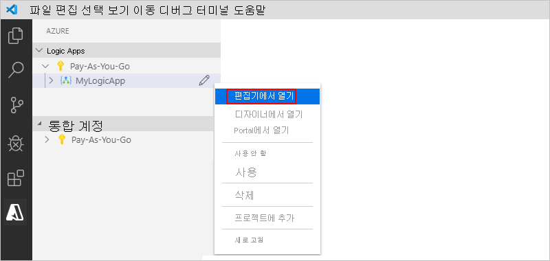
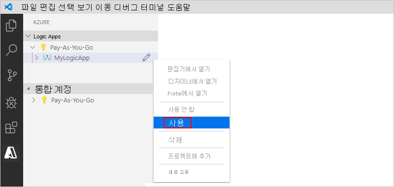
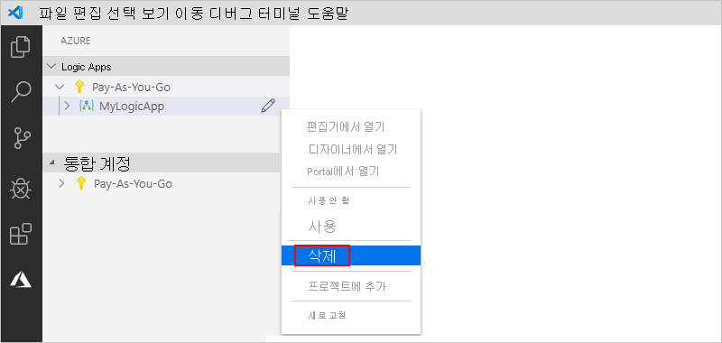

# <a name="quickstart-create-and-manage-logic-app-workflow-definitions-with-multi-tenant-azure-logic-apps-and-visual-studio-code"></a>빠른 시작: 다중 테넌트 Azure Logic Apps 및 Visual Studio Code를 사용하여 논리 앱 워크플로 정의 만들기 및 관리

이 빠른 시작에서는 다중 테넌트 [Azure Logic Apps](../logic-apps/logic-apps-overview.md) 및 Visual Studio Code를 사용하여 조직 및 기업 전체에서 앱, 데이터, 시스템 및 서비스를 통합하는 작업 및 프로세스를 자동화하는 데 도움이 되는 논리 앱 워크플로를 만들고 관리하는 방법을 보여줍니다. 코드 기반 환경을 통해 논리 앱에 JSON(JavaScript Object Notation)을 사용하는 기본 워크플로 정의를 만들고 편집할 수 있습니다. Azure에 이미 배포된 기존 논리 앱에서 작업할 수도 있습니다. 다중 테넌트 및 단일 테넌트 모델에 대한 자세한 내용은 [단일 테넌트 및 다중 테넌트 비교와 통합 서비스 환경](single-tenant-overview-compare.md)을 검토하세요.

[Azure Portal](https://portal.azure.com) 및 Visual Studio에서 이러한 동일 작업을 수행할 수도 있지만, 논리 앱 정의를 이미 숙지하고 있으며 코드에서 직접 작업하려는 경우 Visual Studio Code를 사용하면 작업을 더 빨리 시작할 수 있습니다. 예를 들어 이미 생성된 논리 앱을 사용하거나 사용하지 않도록 설정하고 삭제하고 새로 고칠 수 있습니다. 또한 Linux, Windows 및 Mac과 같은 Visual Studio Code가 실행되는 모든 개발 플랫폼의 논리 앱 및 통합 계정에서 작업할 수 있습니다.

이 문서의 경우 기본적인 개념에 대해 더 중점적으로 설명하는 [빠른 시작](../logic-apps/quickstart-create-first-logic-app-workflow.md)에서 동일한 논리 앱을 만들 수 있습니다. 또한 [Visual Studio에서 예제 앱을 만드는 방법에 대해 학습](quickstart-create-logic-apps-with-visual-studio.md)하고 [Azure CLI(Azure 명령줄 인터페이스)를 통해 앱을 만들고 관리하는 방법을 학습할 수 있습니다](quickstart-logic-apps-azure-cli.md). Visual Studio Code에서 논리 앱은 다음 예제와 같이 표시됩니다.


## <a name="prerequisites"></a>전제 조건

시작하기 전에 이러한 항목이 있는지 확인합니다.

* Azure 계정 및 구독이 없는 경우 [체험 Azure 계정에 가입](https://azure.microsoft.com/free/)합니다.

* [논리 앱 워크플로 정의](../logic-apps/logic-apps-workflow-definition-language.md) 및 JSON에 설명된 해당 구조에 대한 기본 지식

  Logic Apps를 처음 사용하는 경우 Azure Portal에서 첫 번째 논리 앱을 만들고 기본적인 개념에 대해 더 중점적으로 설명하는 [빠른 시작](../logic-apps/quickstart-create-first-logic-app-workflow.md)을 확인해 보세요.

* Azure 및 Azure 구독에 로그인하기 위해 웹에 액세스.

* 다음 도구가 없으면 다운로드하여 설치합니다.

  * 체험인 [Visual Studio Code 버전 1.25.1 이상](https://code.visualstudio.com/).

  * Azure Logic Apps용 Visual Studio Code 확장

    이 확장은 [Visual Studio Marketplace](https://marketplace.visualstudio.com/items?itemName=ms-azuretools.vscode-logicapps)에서 다운로드하여 설치하거나 Visual Studio Code 내에서 직접 설치할 수 있습니다. 설치한 후 Visual Studio Code를 다시 로드해야 합니다.

    

    확장이 올바르게 설치되었는지 확인하기 위해 Visual Studio Code 도구 모음에 표시되는 Azure 아이콘을 선택합니다.

    

    자세한 내용은 [확장 마켓플레이스](https://code.visualstudio.com/docs/editor/extension-gallery)를 참조하세요. 이 확장의 오픈 소스 버전에 참여하려면 [GitHub의 Visual Studio Code용 Azure Logic Apps 확장](https://github.com/Microsoft/vscode-azurelogicapps)을 방문합니다.

* 논리 앱이 특정 IP 주소로 트래픽을 제한하는 방화벽을 통해 통신해야 하는 경우 해당 방화벽은 논리 앱이 있는 Azure 지역의 런타임 또는 Logic Apps 서비스에서 사용하는 [인바운드](logic-apps-limits-and-config.md#inbound) 및 [아웃바운드](logic-apps-limits-and-config.md#outbound) IP 주소 *모두* 에 대한 액세스를 허용해야 합니다. 논리 앱에서 Office 365 Outlook 커넥터 또는 SQL 커넥터와 같은 [관리형 커넥터](../connectors/managed.md)를 사용하거나 [사용자 지정 커넥터](/connectors/custom-connectors/)를 사용하는 경우 방화벽은 논리 앱의 Azure 지역에 있는 [관리형 커넥터 아웃바운드 IP 주소](logic-apps-limits-and-config.md#outbound) *모두* 에 대한 액세스도 허용해야 합니다.

<a name="access-azure"></a>

## <a name="access-azure-from-visual-studio"></a>Visual Studio에서 Azure에 액세스

1. Visual Studio Code를 엽니다. Visual Studio Code 도구 모음에서 Azure 아이콘을 선택합니다.

   

1. Azure 창의 **Logic Apps** 아래에서 **Azure에 로그인** 을 선택합니다. Microsoft 로그인 페이지에서 로그인하라는 메시지가 표시되면 Azure 계정으로 로그인합니다.

   

   1. 로그인 시간이 평소보다 더 오래 걸리면 Visual Studio Code에서 디바이스 코드를 제공하여 Microsoft 인증 웹 사이트를 통해 로그인하라는 메시지를 표시합니다. 코드를 사용하여 대신 로그인하려면 **디바이스 코드 사용** 을 선택합니다.

      

   1. 코드를 복사하려면 **복사 후 열기** 를 선택합니다.

      

   1. 새 브라우저 창을 열고 인증 웹 사이트로 이동하려면 **링크 열기** 를 선택합니다.

      

   1. **계정에 로그인** 페이지에서 인증 코드를 입력하고, **다음** 을 선택합니다.

      

1. Azure 계정을 선택합니다. 로그인한 후 브라우저를 닫고 Visual Studio Code로 돌아갈 수 있습니다.

   이제 Azure 창의 **Logic Apps** 및 **통합 계정** 섹션에서 계정과 연결된 Azure 구독이 표시됩니다. 그러나 원하는 구독이 표시되지 않거나 섹션에서 너무 많은 구독이 표시되는 경우 다음 단계를 수행합니다.

   1. 포인터를 **Logic Apps** 레이블 위로 이동합니다. 도구 모음이 표시되면 **구독 선택**(필터 아이콘)을 선택합니다.

      

   1. 표시되는 목록에서 표시하려는 구독을 선택합니다.

1. **Logic Apps** 아래에서 원하는 구독을 선택합니다. 구독 노드가 펼쳐지고 해당 구독에 있는 모든 논리 앱이 표시됩니다.

   

   > [!TIP]
   > **통합 계정** 아래에서 구독을 선택하면 해당 구독에 있는 모든 통합 계정이 표시됩니다.

<a name="create-logic-app"></a>

## <a name="create-new-logic-app"></a>새 논리 앱 만들기

1. Visual Studio Code 내에서 아직 Azure 계정 및 구독에 로그인하지 않은 경우 [이전 단계에 따라 지금 로그인합니다](#access-azure).

1. Visual Studio Code의 **Logic Apps** 아래에서 구독의 바로 가기 메뉴를 열고 **Logic App 만들기** 를 선택합니다.

   

   표시되는 목록에서 구독의 모든 Azure 리소스 그룹이 표시됩니다.

1. 리소스 그룹 목록에서 **새 리소스 그룹 만들기** 또는 기존 리소스 그룹을 선택합니다. 여기서는 새 리소스 그룹을 만듭니다.

   

1. Azure 리소스 그룹의 이름을 제공하고, Enter 키를 누릅니다.

   

1. 논리 앱의 메타데이터를 저장하려는 Azure 지역을 선택합니다.

   

1. 논리 앱의 이름을 제공하고, Enter 키를 누릅니다.

   

   Azure 창의 Azure 구독 아래에서 새 빈 논리 앱이 표시됩니다. 또한 Visual Studio Code에서는 논리 앱에 대한 기본 워크플로 정의가 포함된 JSON(.logicapp.json) 파일이 열립니다. 이제 이 JSON 파일에서 논리 앱의 워크플로 정의를 수동으로 작성할 수 있습니다. 워크플로 정의의 구조 및 구문에 대한 기술 참조는 [Azure Logic Apps의 워크플로 정의 언어 스키마](../logic-apps/logic-apps-workflow-definition-language.md)를 참조하세요.

   

   예를 들어 RSS 트리거 및 Office 365 Outlook 작업으로 시작하는 논리 앱 워크플로 정의 샘플은 다음과 같습니다. 일반적으로 JSON 요소는 각 섹션에서 사전순으로 표시됩니다. 그러나 이 샘플은 이러한 요소들을 로직 앱의 단계가 설계자에 나타나는 순서대로 대략적으로 보여줍니다.

   > [!IMPORTANT]
   > 이 논리 앱 정의 샘플을 다시 사용하려면 조직 계정(예 : @fabrikam.com)이 필요합니다. 가상 이메일 주소를 사용자 고유의 이메일 주소로 바꾸어야 합니다. Outlook.com 또는 Gmail과 같은 다른 이메일 커넥터를 사용하려면 `Send_an_email_action` 작업을 [Azure Logic Apps에서 지원하는 이메일 커넥터](../connectors/apis-list.md)에서 사용할 수 있는 비슷한 작업으로 바꿉니다.
   >
   > Gmail 커넥터를 사용하려는 경우 G Suite 비즈니스 계정만 논리 앱에서 제한 없이 이 커넥터를 사용할 수 있습니다. 
   > Gmail 소비자 계정이 있는 경우 특정 Google 승인 서비스에서만 이 커넥터를 사용하거나 [Gmail 커넥터 인증에 사용할 Google 클라이언트 앱을 만들](/connectors/gmail/#authentication-and-bring-your-own-application) 수 있습니다. 
   > 자세한 내용은 [Azure Logic Apps의 Google 커넥터에 대한 데이터 보안 및 개인정보처리방침](../connectors/connectors-google-data-security-privacy-policy.md)을 참조하세요.

   ```json
   {
      "$schema": "https://schema.management.azure.com/providers/Microsoft.Logic/schemas/2016-06-01/workflowdefinition.json#",
      "contentVersion": "1.0.0.0",
      "parameters": {
         "$connections": {
            "defaultValue": {},
            "type": "Object"
         }
      },
      "triggers": {
         "When_a_feed_item_is_published": {
            "recurrence": {
               "frequency": "Minute",
               "interval": 1
            },
            "splitOn": "@triggerBody()?['value']",
            "type": "ApiConnection",
            "inputs": {
               "host": {
                  "connection": {
                     "name": "@parameters('$connections')['rss']['connectionId']"
                  }
               },
               "method": "get",
               "path": "/OnNewFeed",
               "queries": {
                  "feedUrl": "http://feeds.reuters.com/reuters/topNews"
               }
            }
         }
      },
      "actions": {
         "Send_an_email_(V2)": {
            "runAfter": {},
            "type": "ApiConnection",
            "inputs": {
               "body": {
                  "Body": "<p>Title: @{triggerBody()?['title']}<br>\n<br>\nDate published: @{triggerBody()?['updatedOn']}<br>\n<br>\nLink: @{triggerBody()?['primaryLink']}</p>",
                  "Subject": "RSS item: @{triggerBody()?['title']}",
                  "To": "sophia-owen@fabrikam.com"
               },
               "host": {
                  "connection": {
                     "name": "@parameters('$connections')['office365']['connectionId']"
                  }
               },
               "method": "post",
               "path": "/v2/Mail"
            }
         }
      },
      "outputs": {}
   }
   ```

1. 완료되면 논리 앱의 워크플로 정의를 저장합니다. (파일 메뉴 > 저장 또는 Ctrl+S 누르기)

1. 논리 앱을 Azure 구독에 업로드하라는 메시지가 표시되면 **업로드** 를 선택합니다.

   이 단계에서는 논리 앱을 [Azure Portal](https://portal.azure.com)에 게시합니다. 그러면 논리가 활성 상태가 되어 Azure에서 실행될 수 있습니다.

   

## <a name="view-logic-app-in-designer"></a>디자이너에서 논리 앱 보기

Visual Studio Code에서는 논리 앱을 읽기 전용 디자인 보기에서 열 수 있습니다. 디자이너에서 논리 앱을 편집할 수는 없지만 디자이너 보기를 사용하여 논리 앱의 워크플로를 시각적으로 확인할 수 있습니다.

Azure 창의 **Logic Apps** 아래에서 논리 앱의 바로 가기 메뉴를 열고 **디자이너에서 열기** 를 선택합니다.

읽기 전용 디자이너가 별도의 창에서 열려 논리 앱의 워크플로가 표시됩니다. 예를 들어 다음과 같습니다.


## <a name="view-in-azure-portal"></a>Azure Portal에서 보기

Azure Portal에서 논리 앱을 검토하려면 다음 단계를 수행합니다.

1. 논리 앱과 연결된 동일한 Azure 계정 및 구독을 사용하여 [Azure Portal](https://portal.azure.com)에 로그인합니다.

1. Azure Portal의 검색 상자에서 논리 앱의 이름을 입력합니다. 결과 목록에서 논리 앱을 선택합니다.

   

<a name="edit-logic-app"></a>

## <a name="edit-deployed-logic-app"></a>배포된 논리 앱 편집

Visual Studio Code에서는 이미 배포된 Azure 논리 앱의 워크플로 정의를 열고 편집할 수 있습니다.

> [!IMPORTANT] 
> 프로덕션에서 활발하게 실행되는 논리 앱을 편집하려면 먼저 [논리 앱을 사용하지 않도록 설정](#disable-enable-logic-apps)하여 해당 논리 앱을 중단시키는 위험을 피하고 중단을 최소화해야 합니다.

1. Visual Studio Code 내에서 아직 Azure 계정 및 구독에 로그인하지 않은 경우 [이전 단계에 따라 지금 로그인합니다](#access-azure).

1. Azure 창의 **Logic Apps** 아래에서 Azure 구독을 확장하고 원하는 논리 앱을 선택합니다.

1. 논리 앱 메뉴를 열고 **편집기에서 열기** 를 선택합니다. 또는 논리 앱의 이름 옆에 있는 편집 아이콘을 선택합니다.

   

   Visual Studio Code에서는 논리 앱의 워크플로 정의를 볼 수 있도록 로컬 임시 폴더에서 .logicapp.json 파일을 엽니다.

   

1. 논리 앱의 워크플로 정의를 변경합니다.

1. 완료되면 변경 사항을 저장합니다. (파일 메뉴 > 저장 또는 Ctrl+S 누르기)

1. Azure Portal에서 변경 내용을 업로드하고 기존 논리 앱을 *덮어쓰라는* 메시지가 표시되면 **업로드** 를 선택합니다.

   이 단계에서는 [Azure Portal](https://portal.azure.com)에서 논리 앱에 대한 업데이트를 게시합니다.

   

## <a name="view-or-promote-other-versions"></a>다른 버전 보기 또는 승격

Visual Studio Code에서는 논리 앱의 이전 버전을 열고 검토할 수 있습니다. 또한 이전 버전을 현재 버전으로 승격할 수도 있습니다.

> [!IMPORTANT] 
> 프로덕션에서 활발하게 실행되는 논리 앱을 변경하려면 먼저 [논리 앱을 사용하지 않도록 설정](#disable-enable-logic-apps)하여 해당 논리 앱을 중단시키는 위험을 피하고 중단을 최소화해야 합니다.

1. 해당 구독의 모든 논리 앱을 볼 수 있도록 Azure 창의 **Logic Apps** 아래에서 Azure 구독을 펼칩니다.

1. 구독 아래에서 논리 앱, **버전** 을 차례로 펼칩니다.

   **버전** 목록에서 논리 앱의 이전 버전(있는 경우)이 표시됩니다.

   

1. 이전 버전을 보려면 다음 단계 중 하나를 선택합니다.

   * JSON 정의를 보려면 **버전** 아래에서 해당 정의의 버전 번호를 선택합니다. 또는 해당 버전의 바로 가기 메뉴를 열고 **편집기에서 열기** 를 선택합니다.

     로컬 컴퓨터에서 새 파일이 열리고 해당 버전의 JSON 정의가 표시됩니다.

   * 읽기 전용 디자이너 보기에서 버전을 보려면 해당 버전의 바로 가기 메뉴를 열고 **디자이너에서 열기** 를 선택합니다.

1. 이전 버전을 현재 버전으로 승격하려면 다음 단계를 수행합니다.

   1. **버전** 아래에서 이전 버전의 바로 가기 메뉴를 열고 **승격** 을 선택합니다.

      

   1. Visual Studio Code에서 확인을 요청하는 메시지가 표시된 후 계속하려면 **예** 를 선택합니다.

      

      Visual Studio Code는 선택한 버전을 현재 버전으로 승격하고 새 번호를 승격된 버전에 할당합니다. 이제 이전의 현재 버전이 승격된 버전 아래에 표시됩니다.

<a name="disable-enable-logic-apps"></a>

## <a name="disable-or-enable-logic-apps"></a>논리 앱 사용 또는 사용하지 않도록 설정

Visual Studio Code에서는 게시된 논리 앱을 편집하고 변경 내용을 저장하는 경우 이미 배포된 앱을 *덮어씁니다*. 프로덕션에서 논리 앱이 중단되지 않도록 방지하고 중단을 최소화하려면 먼저 논리 앱을 사용하지 않도록 설정합니다. 그런 다음, 논리 앱이 여전히 작동하는지 확인한 후에 논리 앱을 다시 활성화할 수 있습니다.

> [!NOTE]
> 논리 앱을 사용하지 않도록 설정하면 다음과 같은 방식으로 워크플로 인스턴스에 영향을 줍니다.
>
> * Logic Apps 서비스는 완료될 때까지 모든 진행 중인 실행 및 보류 중인 실행을 계속합니다. 볼륨 또는 백로그에 따라 이 프로세스를 완료하는 데 시간이 걸릴 수 있습니다.
>
> * Logic Apps 서비스는 새 워크플로 인스턴스를 만들거나 실행하지 않습니다.
>
> * 트리거는 다음에 조건이 충족될 때 발생하지 않습니다. 하지만 트리거 상태는 논리 앱이 중지된 지점을 기억합니다. 따라서 논리 앱을 다시 활성화하면 마지막 실행 이후 처리되지 않은 모든 항목에 대해 트리거가 발생합니다.
>
>   트리거가 마지막 실행 이후 처리되지 않은 항목에서 발생하지 않도록 하려면 논리 앱을 다시 활성화하기 전에 트리거의 상태를 지우세요.
>
>   1. 논리 앱에서 워크플로의 트리거 일부를 편집합니다.
>   1. 변경 내용을 저장합니다. 이 단계는 트리거의 현재 상태를 다시 설정합니다.
>   1. 논리 앱을 다시 활성화합니다.

1. Visual Studio Code 내에서 아직 Azure 계정 및 구독에 로그인하지 않은 경우 [이전 단계에 따라 지금 로그인합니다](#access-azure).

1. 해당 구독의 모든 논리 앱을 볼 수 있도록 Azure 창의 **Logic Apps** 아래에서 Azure 구독을 펼칩니다.

   1. 원하는 논리 앱을 사용하지 않도록 설정하려면 논리 앱의 메뉴를 열고 **사용 안 함** 을 선택합니다.

      

   1. 논리 앱을 다시 활성화할 준비가 되면 논리 앱 메뉴를 열고 **사용** 을 선택합니다.

      

<a name="delete-logic-apps"></a>

## <a name="delete-logic-apps"></a>논리 앱 삭제

논리 앱을 삭제하면 다음과 같은 방식으로 워크플로 인스턴스에 영향을 줍니다.

* Logic Apps 서비스가 진행 중이거나 보류 중인 실행을 취소하기 위해 전력을 다합니다.

  볼륨이나 백로그가 큰 경우에도 대부분의 실행은 완료 또는 시작 전에 취소됩니다. 그러나 취소 프로세스를 완료하는 데 시간이 걸릴 수 있습니다. 서비스가 취소 프로세스를 진행하는 동안 일부 실행을 선택하여 진행할 수 있습니다.

* Logic Apps 서비스는 새 워크플로 인스턴스를 만들거나 실행하지 않습니다.

* 워크플로를 삭제한 다음, 동일한 워크플로를 다시 만들면 다시 생성된 워크플로에는 삭제된 워크플로와 동일한 메타데이터가 포함되지 않습니다. 삭제된 워크플로를 호출한 모든 워크플로를 다시 저장해야 합니다. 이렇게 하면 호출자가 다시 생성된 워크플로에 대한 올바른 정보를 가져옵니다. 그렇지 않으면 다시 생성된 워크플로에 대한 호출이 `Unauthorized` 오류와 함께 실패합니다. 이 동작은 Azure 함수를 호출하는 워크플로 및 통합 계정에서 아티팩트를 사용하는 워크플로에도 적용됩니다.

1. Visual Studio Code 내에서 아직 Azure 계정 및 구독에 로그인하지 않은 경우 [이전 단계에 따라 지금 로그인합니다](#access-azure).

1. 해당 구독의 모든 논리 앱을 볼 수 있도록 Azure 창의 **Logic Apps** 아래에서 Azure 구독을 펼칩니다.

1. 삭제하려는 논리 앱을 찾고, 논리 앱 메뉴를 열고, **삭제** 를 선택합니다.

   

## <a name="next-steps"></a>다음 단계

> [!div class="nextstepaction"]
> [Visual Studio Code에서 단일 테넌트 기반 논리 앱 워크플로 만들기](../logic-apps/create-single-tenant-workflows-visual-studio-code.md)
