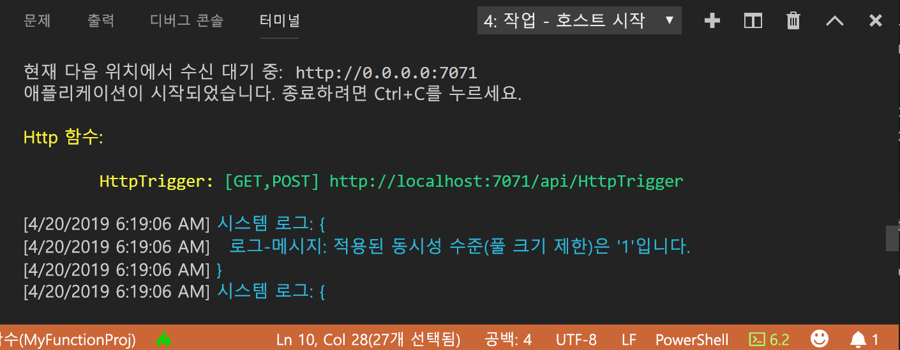

## <a name="run-the-function-locally"></a>로컬에서 함수 실행

Azure Functions Core Tools는 Visual Studio Code와 통합되어 사용자가 Azure Functions 프로젝트를 로컬로 실행하고 디버그할 수 있도록 합니다. Visual Studio Code에서 디버그하는 방법에 대한 자세한 내용은 [PowerShell Azure Functions를 로컬로 디버그](../articles/azure-functions/functions-debug-powershell-local.md)를 참조하세요. 

1. F5 키를 눌러 함수 앱 프로젝트를 시작합니다. 핵심 도구의 출력이 **터미널** 패널에 표시됩니다.

1. **터미널** 패널에서 HTTP 트리거 함수의 URL 엔드포인트를 복사합니다.

    

1. 쿼리 문자열을 이 URL에 `?name=<yourname>`을 추가한 다음, 두 번째 PowerShell 명령 프롬프트에서 `Invoke-RestMethod`를 사용하여 다음과 같이 요청을 실행합니다.

    ```powershell
    PS > Invoke-RestMethod -Method Get -Uri http://localhost:7071/api/HttpTrigger?name=PowerShell
    Hello PowerShell
    ```

    다음 URL의 브라우저에서 GET 요청을 실행할 수도 있습니다.

    `http://localhost:7071/api/HttpExample?name=PowerShell`

    `name` 매개 변수를 쿼리 매개 변수로 또는 본문에 전달하지 않고 HttpTrigger 엔드포인트을 호출하는 경우 이 함수는 `BadRequest` 오류를 반환합니다. run.ps1의 코드를 검토하면 의도적으로 이 오류가 발생하는 것을 확인할 수 있습니다.

1. 요청에 대한 정보는 **터미널** 패널에 표시됩니다.

    

1. 완료되면 **Ctrl + C**를 눌러 Core Tools를 중지합니다.

함수가 로컬 컴퓨터에서 제대로 실행되는지 확인한 후에 해당 프로젝트를 Azure에 게시해야 합니다.